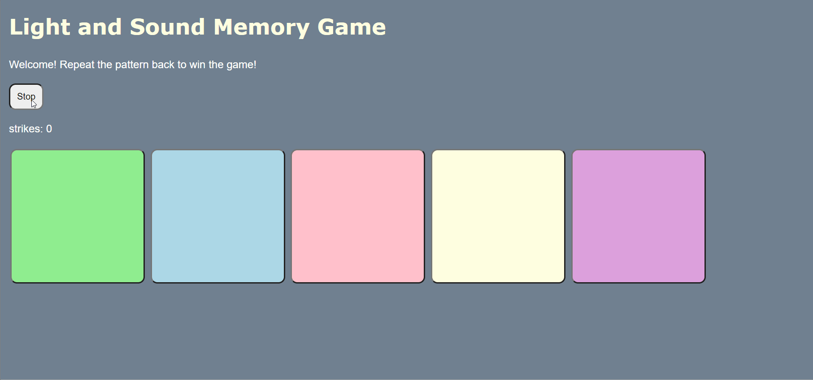

# Pre-work - *Memory Game*

**Memory Game** is a Light & Sound Memory game to apply for CodePath's SITE Program. 

Submitted by: **Jenny Lee**

Time spent: **2** hours spent in total

Link to project: https://glitch.com/edit/#!/simple-memory-game-0

## Required Functionality

The following **required** functionality is complete:

* [X] Game interface has a heading (h1 tag), a line of body text (p tag), and four buttons that match the demo app
* [X] "Start" button toggles between "Start" and "Stop" when clicked. 
* [X] Game buttons each light up and play a sound when clicked. 
* [X] Computer plays back sequence of clues including sound and visual cue for each button
* [X] Play progresses to the next turn (the user gets the next step in the pattern) after a correct guess. 
* [X] User wins the game after guessing a complete pattern
* [X] User loses the game after an incorrect guess

The following **optional** features are implemented:

* [X] Any HTML page elements (including game buttons) has been styled differently than in the tutorial
* [X] Buttons use a pitch (frequency) other than the ones in the tutorial
* [X] More than 4 functional game buttons
* [X] Playback speeds up on each turn
* [ ] Computer picks a different pattern each time the game is played
* [X] Player only loses after 3 mistakes (instead of on the first mistake)
* [ ] Game button appearance change goes beyond color (e.g. add an image)
* [ ] Game button sound is more complex than a single tone (e.g. an audio file, a chord, a sequence of multiple tones)
* [ ] User has a limited amount of time to enter their guess on each turn

The following **additional** features are implemented:

- [X] Added a strike counter so the player can see how many mistakes they've made
- [X] After the player makes a mistake, the sequence that they did not successfully pass repeats again

## Video Walkthrough (GIF)

This gif shows a walkthrough of a winning and a losing game.

This gif shows that the "Start" button toggles between "Start" and "Stop" when clicked. 

## Reflection Questions
1. If you used any outside resources to help complete your submission (websites, books, people, etc) list them here. 
https://stackoverflow.com/questions/40086680/how-to-make-the-html-renders-before-the-alert-is-triggered

2. What was a challenge you encountered in creating this submission (be specific)? How did you overcome it? (recommended 200 - 400 words) 

	&emsp;&emsp;A challenge that I encountered in creating this submission is a bug from an optional feature that I implemented. While testing the feature that gives the player three strikes before losing, I noticed that the third strike updates only after closing the alert. At first, I was confused as to why the number ‘3’ was not rendering on the web page. Since the game was able to reach a losing state, this must mean that my global variable ‘mistakes’ was updating correctly. In a primitive attempt to fix this bug, I tried copying and pasting my line of code that renders the number of strikes into the loseGame and stopGame functions. With no luck, I deduced that the bug was somehow related to the presence of the alert dialog. I turned to the internet to find a solution and came across a stackoverflow thread that perfectly encapsulates my situation. I was then able to render the third strike by delaying the alert using the function setTimeout. From this challenge, I gained a deeper understanding as to how browsers render web pages. It turns out that alerts halt all script execution on the page; the setTimeout function ensures that the browser is “free,” allowing the HTML text to update.

3. What questions about web development do you have after completing your submission? (recommended 100 - 300 words) 
[YOUR ANSWER HERE]

4. If you had a few more hours to work on this project, what would you spend them doing (for example: refactoring certain functions, adding additional features, etc). Be specific. (recommended 100 - 300 words) 

	&emsp;&emsp;With a few more hours to spare, I would make it so that the player has to wait for an entire sequence to play before they can click on a button. After playing the game myself, I noticed that clicking on a button before a sequence is fully completed results in the immediate halt of the current sequence and a strike. I believe the experience on the user’s part would be greatly improved with this simple addition.
	
	&emsp;&emsp;To further enhance the user’s experience, I would add music that speeds up as the game progresses. Perhaps an audio track can loop and increase in tempo with every new sequence. This will amplify the player’s concentration and make them more likely to click on the buttons faster. Of course, I would not want this music to hinder the existing tones of the buttons when clicked.
	
	&emsp;&emsp;For more readability, I would divide the current script.js file into two separate files: one that holds all sound synthesis related variables, constants, and functions (sound.js) and another that holds code related to the mechanics of the game (gameMechanics.js).

## Interview Recording URL Link

[My 5-minute Interview Recording](your-link-here)

## License

    Copyright Jenny Lee

    Licensed under the Apache License, Version 2.0 (the "License");
    you may not use this file except in compliance with the License.
    You may obtain a copy of the License at

        http://www.apache.org/licenses/LICENSE-2.0

    Unless required by applicable law or agreed to in writing, software
    distributed under the License is distributed on an "AS IS" BASIS,
    WITHOUT WARRANTIES OR CONDITIONS OF ANY KIND, either express or implied.
    See the License for the specific language governing permissions and
    limitations under the License.
